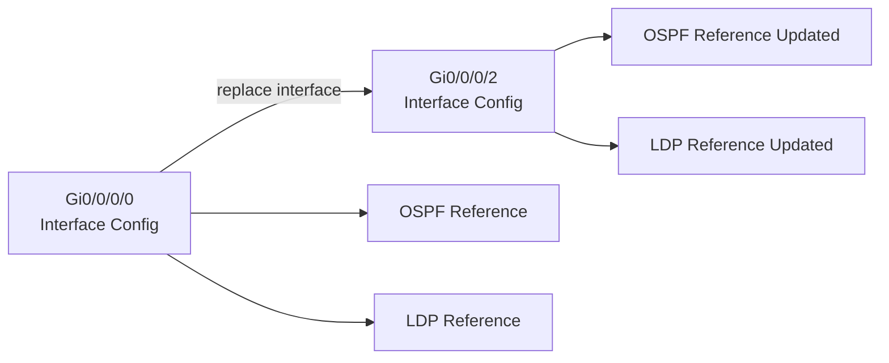
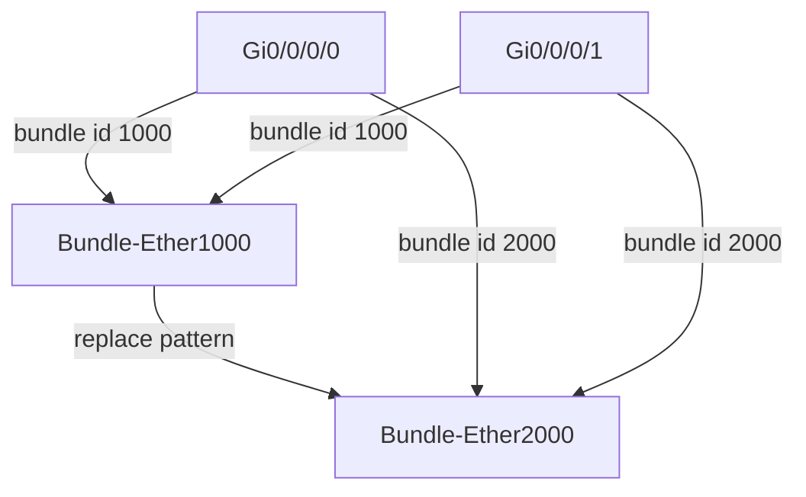

# Cisco IOS XR Replace Command

## Introduction

The **replace** feature in Cisco IOS XR allows operators to programmatically modify existing configuration by:

* Replacing configuration tied to an **interface identifier**, or
* Replacing a **string / regex pattern** across the running configuration

This capability is extremely useful during interface migrations, hardware refreshes, bundle migrations, and large-scale configuration refactoring—while minimizing human error and unnecessary interface flaps.

---

## Replace Command Overview

From global configuration mode:

```text
RP/0/0/CPU0:PE1#configure
RP/0/0/CPU0:PE1(config)#replace ?
  interface  Replace configuration for an interface
  pattern    Replace a string pattern in configuration
```

Both modes support a **dry-run** option to preview changes without loading them into the candidate configuration.

---

## Interface-Based Replace Operation

### High-Level Flow (ASCII Diagram)

```text
Before Replace:

+------------------+        OSPF / LDP / RSVP        +------------------+
|  Interface A     |-------------------------------->| Protocol refs    |
|  Gi0/0/0/0       |                                 | Gi0/0/0/0        |
+------------------+                                 +------------------+

After Replace:

+------------------+        OSPF / LDP / RSVP        +------------------+
|  Interface B     |-------------------------------->| Protocol refs    |
|  Gi0/0/0/2       |                                 | Gi0/0/0/2        |
+------------------+                                 +------------------+

(Source interface removed, destination updated)
```

### Syntax

```text
replace interface <source-interface> with <destination-interface> [dry-run]
```

* Moves **all configuration** from the source interface to the destination interface
* Updates **all references** to the source interface (OSPF, LDP, RSVP, etc.)
* Supports `dry-run` for safe validation

### Sub-Interface Behavior

When replacing interface **X** with **Y**, all sub-interfaces are automatically updated:

```text
X.100  →  Y.100
X.200  →  Y.200
```

---

## Example 1 – Moving Interface Configuration with References

### Configuration Movement Flow (Mermaid)



### Objective

Move all configuration and references from:

```text
GigabitEthernet0/0/0/0 → GigabitEthernet0/0/0/2
```

### Initial Configuration

```text
interface GigabitEthernet0/0/0/0
 description first
 ipv4 address 10.20.30.40 255.255.255.0
!
interface GigabitEthernet0/0/0/2
 description second
 ipv4 address 10.20.50.60 255.255.255.0
!
router ospf 10
 area 0
  interface GigabitEthernet0/0/0/0
   transmit-delay 5
!
mpls ldp
 interface GigabitEthernet0/0/0/0
  igp sync delay on-session-up 5
```

### Dry-Run Validation

```text
replace interface GigabitEthernet0/0/0/0 with GigabitEthernet0/0/0/2 dry-run
```

This displays the exact changes **without modifying** the candidate configuration.

### Execute Replace

```text
replace interface GigabitEthernet0/0/0/0 with GigabitEthernet0/0/0/2
```

### Commit Changes

```text
show commit changes diff
commit
```

### Result

* Interface configuration moved
* OSPF and LDP references updated
* No manual cleanup required

---

## Example 2 – Replace Without Merging Configuration

### Scenario

Destination interface contains **different configuration** (e.g., MTU). The goal is to **fully replace**, not merge.

### Key Step

Delete destination interface **before** replace:

```text
no interface GigabitEthernet0/0/0/2
replace interface GigabitEthernet0/0/0/0 with GigabitEthernet0/0/0/2
```

### IOS XR Optimization (5.3.2+)

Even though the interface is deleted and recreated, IOS XR applies **minimal configuration changes**, preventing:

* Interface flaps
* Unnecessary churn

Non-required configuration (e.g., MTU) is automatically removed.

---

## Pattern-Based Replace Operation

### Pattern Replace Concept (ASCII)

```text
Search Pattern (Regex):        Replacement:
----------------------        ----------------------
GigabitEthernet0/0/0/0   -->  TenGigE0/3/0/0
GigabitEthernet0/0/0/1   -->  TenGigE0/3/0/1
GigabitEthernet0/0/0/2   -->  TenGigE0/3/0/2

Applied globally across:
- Interface blocks
- Routing protocols
- MPLS / LDP / RSVP
```

Pattern-based replace allows **regex-driven configuration changes** across the entire configuration.

### Syntax

```text
replace pattern '<regex>' with '<replacement>' [dry-run]
```

### Important Regex Considerations

* Input is treated as a **regular expression**
* Special characters must be escaped

❌ Incorrect:

```text
replace pattern '1.2.3.4' with '25.26.27.28'
```

✅ Correct:

```text
replace pattern '1\.2\.3\.4' with '25.26.27.28'
```

Improper regex may unintentionally modify unrelated configuration.

---

## Example 3 – Bundle Interface Migration

### Bundle Migration Flow (Mermaid)



### Objective

Move configuration from:

```text
Bundle-Ether1000 → Bundle-Ether2000
```

Including **bundle members**.

### Dry-Run

```text
replace pattern '1000' with '2000' dry-run
```

### Execute Replace

```text
replace pattern '1000' with '2000'
commit
```

### Result

* Logical bundle renamed
* Member interfaces updated
* No manual intervention required

### Alternative Approach

```text
replace interface Bundle-Ether1000 with Bundle-Ether2000
replace pattern 'bundle id 1000 mode active' with 'bundle id 2000 mode active'
```

---

## Example 4 – Bulk Interface Type Migration Using Regex

### Bulk Interface Mapping (ASCII)

```text
Old Interfaces                 New Interfaces
----------------------------   ----------------------------
Gi0/0/0/0   -----------------> TenGigE0/3/0/0
Gi0/0/0/1   -----------------> TenGigE0/3/0/1
Gi0/0/0/2   -----------------> TenGigE0/3/0/2

Single Regex Operation:
replace pattern 'GigabitEthernet0/0/0/([0-2])'
             with 'TenGigE0/3/0/\1'
```

### Objective

Migrate:

```text
GigabitEthernet0/0/0/[0-2] → TenGigE0/3/0/[0-2]
```

### Regex Replace

```text
replace pattern 'GigabitEthernet0/0/0/([0-2])' with 'TenGigE0/3/0/\1' dry-run
```
Capture groups are created using parentheses ()
So you just need to count the parentheses pairs.

Count the groups:

([0-2]) → 1 pair of parentheses

Only 1 capture group exists
So only \1 is valid.

### Benefits

* Preserves interface numbering
* Updates routing protocol references
* Ideal for hardware refresh or speed upgrades

---

## Key Takeaways

* `replace interface` is best for **single interface migrations**
* `replace pattern` is powerful for **bulk changes** and **bundle operations**
* Always use **dry-run** before committing
* Regex precision is critical
* IOS XR intelligently minimizes config churn

---

## Use Cases

* Line card replacement
* Interface renumbering
* Bundle migration
* Speed upgrades (GE → 10GE)
* Mass configuration refactoring

---

## Note

* replace pattern 'S1-MME' with 'S1MME' dry-run
* replace pattern 'S1-MME' with 'S1MME'

### Author

**Pradeep**
Network Engineer | Data Center & IOS XR

---
